# 🤖 Rooney Voice Agent - Sylvie's Kitchen

**An intelligent voice AI agent that handles incoming phone calls for Sylvie's Kitchen restaurant, automating reservations, answering FAQs, and providing 24/7 customer support through natural conversation.**

[](/)
[](/)
[](/)

---

## 🎯 Project Overview

Rooney is a sophisticated voice AI agent specifically designed for **Sylvie's Kitchen**, an Asian Fusion restaurant in Seattle. The system handles complete phone-based customer interactions including:

- **Smart Reservations**: Availability checking → Personal details collection → Booking confirmation
- **Intelligent FAQ**: RAG-powered responses using restaurant handbook knowledge
- **Natural Conversation**: Handles hesitant speech, interruptions, and context switching
- **Multi-Modal Confirmations**: SMS notifications with reservation details

---

## 🏗️ System Architecture

### **High-Level Architecture**

```mermaid
graph TB
    subgraph "External Services"
        PHONE[📞 Customer Phone]
        TWILIO[🌐 Twilio Voice API]
        OPENAI[🧠 OpenAI GPT-4]
        VECTORIZE[🔍 Vectorize.io RAG]
        SMS[📱 Twilio SMS]
    end
    
    subgraph "Core Application"
        SERVER[🖥️ Express Server]
        VOICE[🎤 Voice Processor]
        CONV[💭 Conversation Manager]
        RAG[📚 RAG Service]
        RES[📋 Reservation Manager]
        NOTIF[📨 Notification Service]
    end
    
    subgraph "Data Layer"
        DB[(🗄️ SQLite Database)]
        HANDBOOK[📖 Restaurant Handbook]
        CALENDAR[📅 Web Calendar UI]
    end
    
    PHONE --> TWILIO
    TWILIO --> SERVER
    SERVER --> VOICE
    VOICE --> CONV
    CONV --> OPENAI
    CONV --> RAG
    RAG --> VECTORIZE
    CONV --> RES
    RES --> DB
    RES --> NOTIF
    NOTIF --> SMS
    HANDBOOK --> RAG
    DB --> CALENDAR
    
    style SERVER fill:#e1f5fe
    style VOICE fill:#f3e5f5
    style CONV fill:#e8f5e8
    style RES fill:#fff3e0
    style DB fill:#fce4ec
```


### **Voice Processing Pipeline**

```mermaid
graph LR
    A[📞 Incoming Call] --> B[🎤 Speech-to-Text]
    B --> C{🎯 Intent Analysis}
    
    C -->|FAQ| D[🔧 Query Preprocessing]
    D --> E[🔍 RAG Search]
    E --> F[📝 Generate Response]
    
    C -->|Reservation| G[📊 Extract Details]
    G --> H{📋 Complete Info?}
    H -->|No| I[❓ Ask Missing Info]
    H -->|Yes| J[✅ Check Availability]
    J --> K[💾 Book & Confirm]
    
    F --> L[🗣️ Text-to-Speech]
    I --> L
    K --> M[📱 Send SMS]
    M --> L
    L --> N[📞 Voice Response]
    
    style C fill:#e3f2fd
    style J fill:#f1f8e9
    style M fill:#fff3e0
```


### **Reservation Flow Architecture**

```mermaid
sequenceDiagram
    participant C as Customer
    participant R as Rooney
    participant DB as Database
    participant SMS as SMS Service
    
    C->>R: "Reservation for 4 people Wednesday 7pm"
    R->>R: Extract: date, time, party_size
    R->>R: Normalize: Wednesday → 2025-07-23
    R->>DB: Check availability for 2025-07-23 18:00
    DB->>R: Available (1/20 reservations)
    R->>C: "Great! Available. Name and phone?"
    C->>R: "John Smith, 555-0123"
    R->>R: Extract: name, phone
    R->>DB: Create reservation
    DB->>R: Booking confirmed
    R->>SMS: Send confirmation
    SMS->>C: "🍽️ Reservation confirmed..."
    R->>C: "Confirmed! Anything else?"
```


---

## ✨ Features & Capabilities

### **🎤 Voice Intelligence**
- [x] **Natural Speech Processing**: Handles "um", hesitations, corrections
- [x] **Context Awareness**: Maintains conversation state across turns
- [x] **Intent Recognition**: Distinguishes reservations, FAQs, complaints
- [x] **Smart Query Cleaning**: Preprocesses messy speech for better RAG results
- [x] **Conversation Continuation**: Always asks "anything else?" to keep engaging

### **📅 Reservation Management**
- [x] **Smart Date Parsing**: "Wednesday" → next Wednesday, "tomorrow" → actual date
- [x] **Availability Checking**: 20 reservations per time slot capacity
- [x] **Proper Workflow**: Date/Time/Party Size → Check availability → Get personal details
- [x] **Calendar Integration**: Web-based reservation calendar view
- [x] **Real-time Database**: SQLite with full CRUD operations
- [x] **SMS Confirmations**: Automatic booking confirmations via Twilio

### **🧠 RAG-Powered FAQ System**
- [x] **Semantic Search**: Vectorize.io for restaurant handbook knowledge
- [x] **Query Preprocessing**: Cleans hesitant speech before RAG search
- [x] **Fallback Handling**: Graceful responses when no match found
- [x] **High Accuracy**: Confidence scoring and threshold management
- [x] **Restaurant Knowledge**: Hours, menu, policies, location from PDF handbook

### **🔧 Technical Features**
- [x] **Error Recovery**: Handles API failures, invalid inputs gracefully
- [x] **Comprehensive Logging**: Detailed logs for debugging and monitoring
- [x] **Health Monitoring**: System status and connection checking
- [x] **Scalable Architecture**: Modular design for easy expansion
- [x] **Security**: Environment-based configuration, secure API handling

---

## 🌟 Current Status

### **✅ Fully Implemented & Working**
- **Voice Calling**: Complete Twilio integration with ngrok tunneling
- **Conversation AI**: GPT-4 powered natural language understanding
- **Reservation System**: End-to-end booking with availability checking
- **FAQ System**: RAG-powered responses from restaurant handbook
- **SMS Notifications**: Working Twilio SMS confirmations
- **Web Calendar**: Live reservation viewing interface
- **Query Preprocessing**: Handles hesitant/messy speech patterns
- **Date Intelligence**: Parses "Wednesday", "tomorrow", etc. correctly

### **⏳ Configured But Pending**
- **📧 Email Notifications**: SendGrid configured, ready to enable
- **📅 Google Calendar Sync**: Architecture ready, API integration pending

### **🔄 Ongoing Improvements**
- **Conversation Memory**: Enhanced context retention across calls
- **Advanced Analytics**: Reservation patterns and customer insights
- **Multi-language Support**: Spanish language capabilities

---

## 🚀 Quick Start Guide

### **📋 Prerequisites**
```bash
Node.js 18+
Twilio Account (Voice + SMS)
OpenAI API Key (GPT-4 access)
Vectorize.io Account
ngrok (for local development)
```

### **⚡ Installation**
```bash
# 1. Clone and install
git clone <repository>
cd VoiceAI
npm install

# 2. Configure environment
cp environment-setup.txt .env
# Edit .env with your API keys

# 3. Start the system
npm start

# 4. Start ngrok (separate terminal)
ngrok http 3000
```

### **📞 Testing Your Agent**

#### **Phone Testing (Best)**
```bash
# Your test phone number
Call: +1 (844) 712-0880

# Test scenarios
1. "I want to make a reservation for tomorrow at 7 PM for 4 people"
2. "What are your hours?"
3. "What's on the menu?"
4. "Where are you located?"
```

#### **Web Interface**
```bash
# View reservations calendar
https://your-ngrok-url/reservations/calendar

# Test RAG system
https://your-ngrok-url/voice/test-rag/menu
```

#### **API Testing**
```bash
# Check availability
curl -X POST localhost:3000/reservations/api/check-availability \
  -H "Content-Type: application/json" \
  -d '{"date":"2024-12-25","time":"19:00","partySize":4}'

# Get all reservations
curl localhost:3000/reservations/api/all
```

---

## 🏪 Restaurant Configuration

### **Sylvie's Kitchen Details**
- **Name**: Sylvie's Kitchen
- **Cuisine**: Asian Fusion (Korean Fried Chicken, Taiwanese Bao, Thai Soups)
- **Location**: 1247 Pine Street, Seattle, WA 98101
- **Phone**: (206) 555-CHEF (2433)

### **Operating Schedule**
```
Tuesday - Thursday: 5:00 PM - 10:00 PM
Friday - Saturday:  5:00 PM - 11:00 PM
Sunday:             4:30 PM - 9:30 PM
Monday:             CLOSED

Happy Hour:
Tuesday - Friday:   5:00 PM - 6:30 PM
Saturday:           5:00 PM - 6:00 PM
```

### **Capacity Management**
- **Reservation Slots**: 20 reservations per 30-minute time slot
- **Time Slots**: 5:00 PM, 5:30 PM, 6:00 PM, 6:30 PM, 7:00 PM, 7:30 PM, 8:00 PM, 8:30 PM, 9:00 PM, 9:30 PM
- **Maximum Party Size**: 8 people
- **Advance Booking**: Up to 60 days
- **Same-day Cutoff**: 3:00 PM

---

## 🔧 Development Guide

### **Project Structure**
```
VoiceAI/
├── src/
│   ├── server.js                    # Express server & routes
│   ├── services/
│   │   ├── conversationManager.js   # AI conversation logic
│   │   ├── voiceProcessor.js        # Voice processing pipeline  
│   │   ├── reservationManager.js    # Booking logic & database
│   │   ├── ragService.js            # RAG FAQ system
│   │   └── notificationService.js   # SMS/Email confirmations
│   └── routes/
│       ├── voice.js                 # Twilio webhooks
│       ├── reservations.js          # Reservation API
│       └── index.js                 # Web UI routes
├── data/
│   ├── reservations.db              # SQLite database
│   └── restaurant-handbook.pdf      # RAG knowledge source
├── test-system.js                   # System testing script
├── test-connections.js              # API connection testing
└── environment-setup.txt            # Configuration template
```

### **Key Classes & Services**

#### **VoiceProcessor**
```javascript
// Main voice processing pipeline
processUserInput(speechText, customerPhone, callSid)
normalizeReservationData(data)
checkReservationAvailability(data)
```

#### **ConversationManager** 
```javascript
// AI conversation management
processMessage(userInput, callSid, customerPhone)
analyzeIntent(userInput, conversation)
preprocessQuery(userInput)  // NEW: Cleans hesitant speech
```

#### **ReservationManager**
```javascript
// Reservation business logic
checkAvailability(date, time, partySize)
createReservation(reservationData)
// Supports 20 reservations per time slot
```

### **Environment Variables**
```bash
# Core Services
OPENAI_API_KEY=sk-...
TWILIO_ACCOUNT_SID=AC...
TWILIO_AUTH_TOKEN=...
TWILIO_PHONE_NUMBER=+1844...

# RAG System
VECTORIZE_PIPELINE_ACCESS_TOKEN=...
VECTORIZE_ORGANIZATION_ID=...
VECTORIZE_PIPELINE_ID=...

# Notifications  
SENDGRID_API_KEY=SG...  # Email (configured, pending activation)
FROM_EMAIL=reservations@sylvieskitchen.com

# Restaurant Details
RESTAURANT_NAME="Sylvie's Kitchen"
RESTAURANT_PHONE="+12065552433" 
RESTAURANT_ADDRESS="1247 Pine Street, Seattle, WA 98101"
```

---

## 📊 Monitoring & Analytics

### **Real-time Monitoring**
```bash
# Active conversation stats
GET /voice/stats

# Reservation analytics  
GET /reservations/stats/summary

# System health
GET /health
```

### **Logging & Debugging**
The system provides comprehensive logging:
- 📞 **Call Flow**: Incoming calls, intent detection, response generation
- 🔍 **RAG Operations**: Query preprocessing, search results, confidence scores
- 📅 **Reservations**: Availability checks, booking creation, confirmation sending
- ❌ **Error Handling**: API failures, validation errors, fallback responses

### **Example Log Output**
```
📞 Incoming call from: +19492933178
🎤 Speech received: I want to make a reservation for 4 people tomorrow at 6 PM
🎯 Reservation intent detected. Extracted data: { date: 'tomorrow', time: '6:00 p.m.', partySize: '4' }
🔄 Normalized basic data: { date: '2025-07-22', time: '18:00', partySize: '4' }
🗓️ Checking availability for tuesday, 2025-07-22 at 18:00
📊 Current reservations: 1/20
✅ Available! Asking for personal details...
📱 SMS sent successfully: SMxxx
✅ Reservation confirmed for Tom
```

---

## 🔮 Roadmap & Future Enhancements

### **Phase 2: Enhanced Integration**
- [ ] **Google Calendar Sync**: Bi-directional calendar integration
- [ ] **Email Notifications**: Rich HTML reservation confirmations
- [ ] **Customer Profiles**: Repeat customer recognition and preferences
- [ ] **Advanced Analytics**: Peak times, popular dishes, customer insights

### **Phase 3: Advanced Features**
- [ ] **Multi-language Support**: Spanish conversation capabilities
- [ ] **Voice Customization**: Multiple voice options for different times
- [ ] **Integration Ecosystem**: POS systems, payment processing
- [ ] **AI Improvements**: More sophisticated conversation patterns

### **Phase 4: Enterprise Features**
- [ ] **Multi-location Support**: Franchise/chain restaurant capabilities  
- [ ] **Advanced Reporting**: Business intelligence dashboard
- [ ] **Staff Training**: AI-powered training scenarios
- [ ] **Compliance**: GDPR, accessibility, industry standards

---

## 🛠️ Troubleshooting

### **Common Issues**

#### **Voice Agent Not Responding**
```bash
# Check server status
curl localhost:3000/health

# Verify Twilio webhook
curl localhost:3000/voice/health

# Check ngrok tunnel
curl http://localhost:4040/api/tunnels
```

#### **RAG System Not Finding Answers**
```bash
# Test RAG directly
curl "localhost:3000/voice/test-rag/hours"

# Check Vectorize connection
# Verify VECTORIZE_* environment variables

# Check query preprocessing
# Look for "🔧 Cleaned query:" in logs
```

#### **Reservations Not Working**
```bash
# Check database
sqlite3 data/reservations.db "SELECT COUNT(*) FROM reservations;"

# Test availability API
curl -X POST localhost:3000/reservations/api/check-availability \
  -H "Content-Type: application/json" \
  -d '{"date":"2024-12-25","time":"19:00","partySize":4}'
```

### **Debug Mode**
```bash
# Run with verbose logging
DEBUG=* npm start

# Check specific service logs
DEBUG=reservation* npm start
DEBUG=rag* npm start
```

---

## 🤝 Contributing

### **Development Workflow**
1. **Fork** the repository
2. **Create** a feature branch: `git checkout -b feature/amazing-feature`
3. **Test** thoroughly with phone calls and API testing
4. **Document** changes in README if needed
5. **Submit** a pull request with detailed description

### **Testing Checklist**
- [ ] Phone call flow works end-to-end
- [ ] Reservation booking and confirmation
- [ ] FAQ responses are accurate
- [ ] Error handling graceful
- [ ] SMS notifications working
- [ ] Web calendar updates correctly

---

## 📄 License

MIT License - see LICENSE file for details.

---

## 🆘 Support & Contact

### **Technical Support**
- **GitHub Issues**: For bugs and feature requests
- **Documentation**: This README and inline code comments
- **Testing**: Use provided test scripts and API endpoints

### **Business Contact**
- **Restaurant**: Sylvie's Kitchen
- **Location**: Seattle, WA
- **Phone**: (206) 555-CHEF

---

**Built with ❤️ for Sylvie's Kitchen**

*Powered by Node.js, Twilio, OpenAI GPT-4, Vectorize.io, and SQLite*

---

*Last Updated: July 2025* 